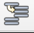

# Create Station

1. Create a new station by going to File -> New Station (Ctrl + N)
2. Create a new reference frame by clicking on the **Add a Reference Frame** button 
3. Double-click on the newly create reference frame in the station tree.
4. Ensure that the X, Y, Z coordinates and rotations are all **zero**.
5. Rename the frame to "World Reference Frame".
6. Import the **Table.stl** 3D model by clicking on the Load file (Local) icon  or dragging and dropping the file into RoboDK.
7. Create another reference frame and name it "Table Workspace Reference Frame".
8. Double click this reference frame in the station tree and change the "Reference position with respect to:" option to "World Reference Frame".
9. Set the X, Y, Z coordinates of this reference frame to the following: 
10. Import the **UR10e.robot** file into RoboDK.
11. Reposition the robot on top of the table by setting the Z coordinate of the UR10e Base Reference frame to the same Z coordinate as the "Table Workspace Reference Frame".
12. Set the X and Y coordinate of the same frame to X = 450.00 mm, Y = 0.00 mm.
13. Import a tool and attach it to the robot by clicking the "Add a tool to a Robot" button  and selecting the **Spindle.tool** file.
14. The spindle tool should be imported into RoboDK and should be attached to the flange of the robot. You may notice that the tool is in a sideways orientation. You can fix this by double-clicking on the "UR10e" object in the station tree to open the robot panel and change the Joint angle of joint 6 $$(\theta_6)$$to $$90\degree$$in the Joint axis jog settings.
15. Right-click on the tool in the station tree and select "Active Tool".
16. Import the **cutting\_sheet.stl** file.
17. Create a new reference frame and name it "Cutting Sheet Reference Frame".
18. Set the coordinates of this reference frame to X = 0.00 mm, Y = 0.00 mm, Z=0.00 mm, with respect to the World Reference Frame.
19. Drag the cutting sheet object into the "Cutting Sheet Reference Frame" in the station tree. This will nest the cutting sheet object inside the reference frame. This can also be done by holding the right-mouse button and dragging the cutting sheet object on top of the reference frame, letting go of the right-mouse button and selecting "Move nested".
20. The position and orientation of the cutting sheet object can now be controlled by modifying the coordinates of the "Cutting Sheet Reference Frame".
21. Change the coordinates of the "Cutting Sheet Reference Frame" to:
22. Point the TCP of the tool downwards (i.e Z axis will face straight down) by changing the joint angle of joint 4 such that the Z axis of the TCP is pointing roughly straight down.
23. Click on the "Align" button on the Joint axis jog control panel so that the Z axis is aligned perfectly vertically downwards.

\

